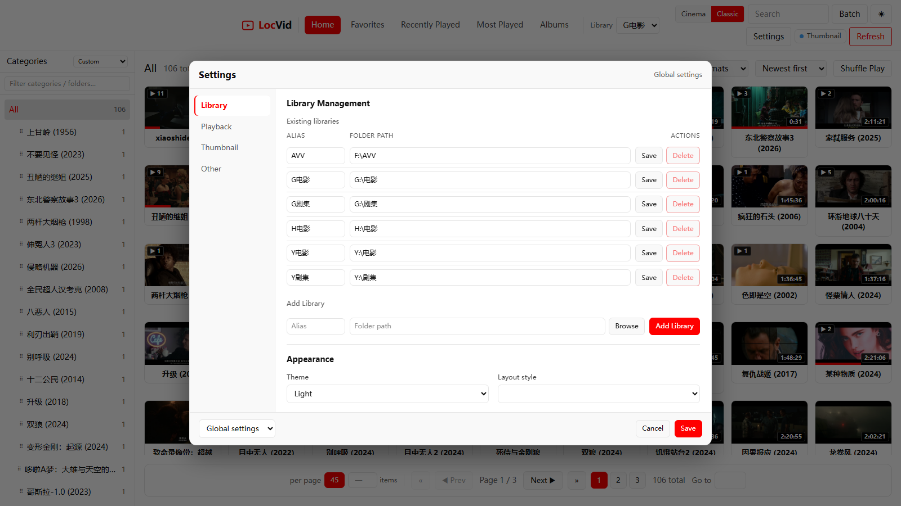

# LocVid — Local Video Library

**[中文版（Chinese Version）](#中文版chinese-version)** · [Changelog](./CHANGELOG.md)

**Double-click to start a local video library web service — browse, search, play and organize every video on your hard drives in the browser.**

> Vue 3 · Classic / Cinema layouts · Single-port dev hot-reload · i18n (English / 中文)

LocVid scans your local video folders, auto-generates a thumbnail grid, and supports category filtering, favorites, play history, albums, an embedded player (movi-player, WASM demux + direct streaming) and an external-player fallback. Built for large Windows-local libraries: new videos are indexed as soon as they are copied in, files still downloading are never mis-reported as failed, and externally deleted files are pruned from favorites/history/albums automatically.

**Default address:** `http://127.0.0.1:3460`

---

### ✨ At a Glance

<table width="100%">
<tr><td style="white-space: nowrap; width: 1%;"><b>🖱 One-click start</b></td><td>Double-click <code>restart.py</code> → stops old process, installs deps, starts service, opens browser</td></tr>
<tr><td style="white-space: nowrap;"><b>📚 Multi-library</b></td><td>Switch between multiple local folders from the top bar; favorites/history/albums/thumbnails are isolated per library</td></tr>
<tr><td style="white-space: nowrap;"><b>📂 Local folders</b></td><td>Recursively scans each library root; top-level subdirectories become "categories"</td></tr>
<tr><td style="white-space: nowrap;"><b>🖼 Smart thumbnails</b></td><td>Generated on demand for the current page; unstable (downloading/writing) files are processed after they settle</td></tr>
<tr><td style="white-space: nowrap;"><b>📺 Episode auto-play</b></td><td>Playlist supports natural filename sort; the player auto-plays the next episode</td></tr>
<tr><td style="white-space: nowrap;"><b>▶ Reliable playback</b></td><td>movi-player embedded player (WASM demux + Range streaming); resume & autoplay configurable; external player auto-detected (default PotPlayer)</td></tr>
<tr><td style="white-space: nowrap;"><b>♥ Favorites & History</b></td><td>Card favorites, recently played, play counts and <strong>resume progress</strong>; auto-cleanup after external deletion</td></tr>
<tr><td style="white-space: nowrap;"><b>📈 Most Played</b></td><td>Dedicated top-bar view ranked by play count; sort options include "Most/Least played"</td></tr>
<tr><td style="white-space: nowrap;"><b>📁 Albums</b></td><td>Custom collections, many-to-many membership; create-album-in-picker, play-all, in-player add</td></tr>
<tr><td style="white-space: nowrap;"><b>🔀 Drag-sortable sidebar</b></td><td>Drag to reorder categories and folders (custom mode); real-time filter box on top</td></tr>
<tr><td style="white-space: nowrap;"><b>🏷 Format handling</b></td><td>Auto remux (repair) for fragmented / multi-mdat MP4 before playback (background batch pre-repair); unsupported codecs prompt for an external player</td></tr>
<tr><td style="white-space: nowrap;"><b>⏱ Duration</b></td><td>Shown on cards; probed by ffprobe in background and cached in the index</td></tr>
<tr><td style="white-space: nowrap;"><b>🔄 Real-time sync</b></td><td>File watching + SSE push; new videos are indexed and queued automatically</td></tr>
<tr><td style="white-space: nowrap;"><b>💾 Data backup</b></td><td>One-click export/import of favorites, history, albums, category order and settings (JSON) for migration</td></tr>
<tr><td style="white-space: nowrap;"><b>🎨 Layout & theme</b></td><td>Classic / Cinema layouts; dark / light theme; one-click toggle in the header</td></tr>
<tr><td style="white-space: nowrap;"><b>🌐 i18n</b></td><td>English / 中文 UI, follows the browser language by default; switch in Settings → Other → Language</td></tr>
</table>

<table width="100%">
<tr><th>Action</th><th>Description</th></tr>
<tr><td style="white-space: nowrap;">Double-click <code>restart.py</code></td><td>Start / restart (dev mode with frontend hot-reload)</td></tr>
<tr><td style="white-space: nowrap;"><code>restart.py --build</code></td><td>Production mode: build frontend, then serve it from the backend</td></tr>
<tr><td style="white-space: nowrap;"><code>python stop.py</code></td><td>Stop backend &amp; frontend dev server, and clean up any ffmpeg/ffprobe processes (use before renaming/moving the folder)</td></tr>
<tr><td>Top bar "♥ Favorites"</td><td>Show only favorited videos</td></tr>
<tr><td>Top bar "⏱ Recently Played"</td><td>Browse by last-played time (desc)</td></tr>
<tr><td>Top bar "📈 Most Played"</td><td>Browse all videos ranked by play count</td></tr>
<tr><td>Top bar "📁 Albums"</td><td>Album list & detail; add via context menu / batch bar / player</td></tr>
<tr><td>Top bar "Refresh"</td><td>Force a full rescan of the library</td></tr>
<tr><td>Hover a card → ♥ / 📁</td><td>Favorite / manage album membership</td></tr>
<tr><td>"Batch" mode</td><td>Multi-select delete, move, batch favorite, add to album, regen thumbnails</td></tr>
</table>

### Screenshots

> Placeholder demo data. 10.0.0+ is the Vue 3 rebuild with upgraded UI/UX.

**Gallery** — category & folder tree on the left, paginated thumbnail grid.

<p align="center"></p>

**Player** — in-page player with right-hand playlist; sortable, prev/next, autoplay.

<p align="center"></p>

**Favorites / History / Settings / Batch** — see below.

<p align="center"></p>
<p align="center"></p>
<p align="center"></p>
<p align="center"></p>

---

## 1. Why

Pain points with large local video libraries: no previews in folders; weak built-in players; heavy NAS/media-server setups; failed thumbnails for still-downloading files.

LocVid's approach: **a lightweight local web service** — browser as the UI, ffmpeg as the engine. Files are scanned in place (no moving, no transcoding into the library); playback goes through movi-player (WASM demux) with auto-remux for broken structures; unstable files are held until they settle.

## 2. Who Is It For

- Managing **large local video collections** on Windows (mixed categories/formats)
- Want **fast thumbnail browsing** in a browser, embedded or external playback
- Need **favorites, play history, batch organization** — without multi-user / public access / metadata scraping
- Have **disguised formats** (e.g. PNG header + MPEG-TS) or huge files — movi-player's WASM demuxer handles them directly

**Not for:** multi-user remote access, mobile apps, TMDB scraping, cloud sync.

## 3. Core Capabilities

| Module | Capability |
|--------|-----------|
| **Multi-library** | Multiple roots, top-bar switching, per-library data isolation; `data/libraries.json` + `data/libraries/{id}/` |
| **Gallery** | Virtual-scroll grid, search (suggestions/history/highlight), many sort modes (incl. most-played), folder tree, breadcrumb |
| **Layout & theme** | Classic / Cinema; dark / light; unified sidebar & pagination across all pages |
| **Category management** | Drag-sort categories & folders (custom mode), sort modes, top filter box |
| **Thumbnails** | On-demand / background backfill, queue progress, failure retry, candidate picking (sharpness scoring), async batch regen |
| **Playback** | movi-player (WASM demux + `/api/stream` Range); hotkeys (C/X/Z speed with memory, Space play/pause, ←/→ seek, Enter fullscreen); configurable autoplay & resume; background auto-remux |
| **Favorites & History** | Persistent JSON; play counts & resume progress; auto-prune on deletion; id migration on rename/move |
| **Most Played** | Top-bar view + sort options ranked by play count |
| **Albums** | Per-library `albums.json`; many-to-many; cover = first video's thumbnail; create-in-picker; id migration on rename/move |
| **Format handling** | Pre-play remux (fragmented/multi-mdat); background batch pre-repair; "Not Playable" badge only for undecodable codecs |
| **File management** | Delete (Recycle Bin), rename (no-extension dialog, extension preserved), move, open folder, properties panel |
| **Data backup** | Export/import favorites/history/albums/category order/settings (JSON) |
| **Stability** | Deferred indexing of unstable files; size/mtime change resets thumb state; watchdog event coalescing (no O(n²)); atomic JSON writes |

> Full specs: [doc/PRD.md](./doc/PRD.md).

## 4. How It Works

```
① Scan & index — watchdog multi-library watching + stability detection → per-library cache → in-memory index + version
         ↓
② Thumbnails  — current page high-priority queue → ffmpeg frame grab → data/libraries/{id}/.thumbs/
         ↓
③ Play plan   — ffprobe codec/container probe → playback_plans.json → direct / auto-remux
         ↓
④ Frontend    — SSE progress → grid cards + movi-player + favorites/history views
```

**Downloading files:** change events → "stabilizing" queue → indexed once size/mtime settle → thumbnails & probe queued; previously mis-marked failures are reconciled.

## 5. Architecture

```
┌─────────────────────────────────────────────────────────┐
│              Browser (Vue 3 SPA / Vite)                 │
│  pages · components · Pinia · movi-player               │
└────────────────────────┬────────────────────────────────┘
                         │ HTTP / SSE (Vite proxy /api in dev)
┌────────────────────────▼────────────────────────────────┐
│              FastAPI (loc_gallery.server)                │
│  REST API · static assets (prod) · SSE push             │
├──────────┬──────────┬──────────┬──────────┬─────────────┤
│  scanner │thumb_mgr │remux_mgr │media_probe│library/    │
│          │          │(repair)  │          │favorite/   │
│          │          │          │          │history/    │
│          │          │          │          │album_store │
└────┬─────┴────┬─────┴────┬─────┴────┬─────┴──────┬──────┘
     ▼          ▼          ▼          ▼            ▼
  library    libraries/   (in-place  playback    favorites.json
  roots      {id}/.thumbs  repaired)  _plans.json play_history.json
              libraries.json          albums.json
```

| Layer | Tech |
|-------|------|
| Frontend | Vue 3, TypeScript, Vite, Pinia, Tailwind CSS 4, movi-player |
| Web framework | FastAPI, uvicorn |
| File watching | watchdog |
| Media | ffmpeg, ffprobe |
| Runtime | Python 3.10+, Node.js 18+ (dev/build), Windows 10/11 |

## 6. Requirements

| Component | Requirement |
|-----------|-------------|
| OS | Windows 10/11 |
| Python | 3.10+ |
| Node.js | 18+ (dev mode & `--build`; `restart.py` can auto-run `npm install` on first start) |
| ffmpeg / ffprobe | Must be on PATH |

## 7. Install

### AI-assisted (recommended)

Paste this prompt into Cursor / OpenCode / Claude Code:

```text
Research https://github.com/hoolulu/LocVid and follow its README to install locally:
1. Clone the repo to a suitable directory (Windows)
2. Ensure Python 3.10+; run python scripts/setup.py (or python restart.py, which installs deps on first run)
3. Ensure Node.js 18+ and npm (dev mode)
4. Ensure ffmpeg & ffprobe on PATH (winget install ffmpeg if needed)
5. Ask for the video library root path, then add it under Settings → Library (never commit real paths)
6. Run python restart.py and confirm http://127.0.0.1:3460 works
7. Click Refresh in the top bar to run the first scan
8. Briefly explain daily usage (restart, settings, favorites/history, classic/cinema layouts)
Never commit or upload anything under data/.
```

### Manual

```powershell
git clone https://github.com/hoolulu/LocVid.git
cd LocVid
pip install -r backend/requirements.txt
cd frontend
npm install
cd ..
python restart.py
```

Browser opens `http://127.0.0.1:3460`. Add your library path under **Settings → Library**, then click **Refresh**.

## 8. Usage

### Playback page hotkeys (page-level; movi built-in hotkeys disabled)

| Key | Action |
|-----|--------|
| C / X / Z | Speed up / normal / slow down (0.1 steps, 0.25x–2x; remembered) |
| Space | Play / Pause |
| ← / → | Backward / Forward 5s |
| Ctrl + ← / → | Backward / Forward 30s |
| Enter | Toggle fullscreen |
| Esc | Close player |

### Browsing

- Sidebar: categories & folders; **drag to reorder** (custom sort mode); **filter box** at the top
- **Search**: title/filename/category/folder, extension-insensitive; suggestions & history; keyword highlight; searches the whole library (clears category/folder filters)
- **Keyboard grid navigation**: ↑↓←→ move focus, Enter play, F favorite, Esc clear; keys yield to the player when open
- Hover a card: multi-segment **video preview** (configurable); videos that play but don't support hover preview show a direct notice
- Right-click a video: Properties / Change Thumbnail / Favorite / Add to Album / Rename / Move / Open Folder / Copy Path / Copy Title / Delete
- **Batch mode**: multi-select delete (Recycle Bin), move, batch favorite, add to album, regen thumbnails

### Albums

- Create / edit / delete albums; **create directly in the add-to-album picker**
- Play-all, video count & total duration, right-click "Set as Cover"
- Membership migrates automatically when a video is renamed/moved

### Data & maintenance

- **Backup**: Settings → Other → Export/Import JSON
- **Thumbnail maintenance**: stats / clean orphans / regenerate failed
- **Rename/move safety**: favorites, history, albums, thumbnails and format cache are **migrated** to the new id — nothing is lost or regenerated

## 9. Settings (global)

Saved to `data/settings.json`; full list in [doc/PRD.md](./doc/PRD.md).

| Key | Default | Description |
|-----|---------|-------------|
| `thumb_position` | 0.6 | Capture position (duration ratio) |
| `thumb_workers` | 3 | Thumbnail worker count (restart required) |
| `thumb_idle_scan` | false | Backfill thumbnails for the whole library in background |
| `thumb_candidate_count` | 6 | Candidate frames per video |
| `thumb_auto_select_best` | false | Auto-pick best frame (single) |
| `thumb_batch_auto_select` | true | Auto-pick best frame (batch) |
| `default_page_size` | 32 | Videos per page (40/80/custom in UI) |
| `default_sort` | mtime_desc | Default gallery sort |
| `watch_ignore_dirs` | (empty) | Directory names to skip while scanning/watching |
| `ui_theme` | dark | dark / light |
| `ui_preset` | netflix | Cinema (full-width) / Classic (sidebar grid) |
| `html5_playlist_autoplay` | true | Auto-play next episode |
| `html5_resume_playback` | true | Remember position and resume |
| `html5_wheel_seek_sec` | 5 | Wheel seek seconds (0 = off) |
| `html5_hover_preview` | true | Hover multi-segment preview |
| `html5_hover_tip_pin` | false | Tooltip dismiss: on mouse leave (default) / via close button |
| `html5_auto_remux` | true | Background batch remux of repairable files |
| `external_player_path` | (auto) | External player exe (VLC/MPC-HC/PotPlayer…) |
| `history_retention_days` | 180 | Play history retention |

## 10. Privacy

Local, single-user by design. When sharing: share `frontend/` `backend/` `scripts/` `doc/` and config templates — **never** `data/` (settings, libraries, logs, thumbs, PIDs). Configure your library paths and PotPlayer path in the Settings page instead of committing them.

## 11. FAQ (excerpt)

- **Library paths**: configure under Settings → Library (Windows folder picker); `config.py`'s `VIDEO_ROOT` is only a local dev seed
- **Downloading files show failed thumbnails?** Files are indexed only after they settle; stale failures are reconciled automatically
- **Externally deleted videos?** Pruned from favorites/history/albums on the next library refresh
- **"Albums" page shows Not Found?** The backend is an old process — run `restart.py` or Settings → Restart Service, then hard-refresh (Ctrl+F5)
- **Where is resume position?** `data/libraries/{library_id}/play_history.json` → `position_sec`
- **`restart.py` vs `restart.py --build`?** Dev mode with Vite hot-reload vs. production build served by the backend

## 12. Development

```powershell
cd <project root>
# Dev (recommended daily): single port 3460, Vite hot-reload
python restart.py
# Backend API only
python dev_backend.py
# Frontend alone (backend required)
cd frontend
npm run dev
# Production build
cd frontend
npm run build
# or
python restart.py --build
```

### Tests

```powershell
$env:PYTHONPATH = "<project root>\backend\src"
python -m pytest backend/tests/test_file_stability.py -v
python -m unittest backend.tests.test_album_store backend.tests.test_album_api backend.tests.test_multi_library -v
python backend/tests/test_auto_new_video.py
```

## 13. Changelog & Docs

- [CHANGELOG.md](./CHANGELOG.md) — releases (English first, Chinese after)
- [doc/PRD.md](./doc/PRD.md) — product requirements

---

## 中文版（Chinese Version）

**本地视频画廊 Web 服务 — 双击启动，浏览器里浏览、搜索、播放你的整个视频库**

> Vue 3 架构 · 经典 / 影院布局 · 单端口开发热更新

扫描本机视频目录，自动生成缩略图网格，支持分类筛选、收藏、播放记录、**我的专辑**、内嵌播放器（movi-player，WASM demux + 硬解直连）与外部播放器兜底。专为 Windows 本地大库设计：新视频拷入即索引，下载中的文件不误报失败，外部删除自动同步收藏、历史与专辑归属。

**默认访问地址：** `http://127.0.0.1:3460`

---

### ✨ 一分钟看懂

<table width="100%">
<tr><td style="white-space: nowrap; width: 1%;"><b>🖱 一键启动</b></td><td>双击 <code>restart.py</code> → 自动停旧进程、装依赖、起服务、打开浏览器</td></tr>
<tr><td style="white-space: nowrap;"><b>📚 多视频库</b></td><td>顶栏「选择视频库」切换多个本地文件夹；收藏、历史、<strong>专辑</strong>、缩略图按库隔离；设置中统一管理</td></tr>
<tr><td style="white-space: nowrap;"><b>📂 本地视频库</b></td><td>递归扫描各库根目录，按一级子目录作为「分类」展示</td></tr>
<tr><td style="white-space: nowrap;"><b>🖼 智能缩略图</b></td><td>按需生成当前页；下载/写入中的文件等待稳定后再处理，不误报失败</td></tr>
<tr><td style="white-space: nowrap;"><b>📺 剧集连播</b></td><td>播放列表支持文件名自然排序；播放器按列表顺序自动播下一集</td></tr>
<tr><td style="white-space: nowrap;"><b>▶ 可靠播放</b></td><td>movi-player 内嵌播放器（WASM demux + 直连 Range 流）；续播与连播可设置；外部播放器自动探测（默认 PotPlayer）</td></tr>
<tr><td style="white-space: nowrap;"><b>♥ 收藏 & 历史</b></td><td>卡片收藏、最近播放、播放次数与<strong>续播进度</strong>；外部删文件后列表自动清理</td></tr>
<tr><td style="white-space: nowrap;"><b>📈 最多播放</b></td><td>顶栏独立视图按播放次数倒序展示全库；浏览页排序下拉可选「最多/最少播放」</td></tr>
<tr><td style="white-space: nowrap;"><b>📁 我的专辑</b></td><td>自定义专辑合集，视频可多专辑归属；本页生成专辑、播放全部、播放器内加入专辑；加入弹窗可直接新建</td></tr>
<tr><td style="white-space: nowrap;"><b>🔀 左栏拖拽</b></td><td>分类与任意层级文件夹支持拖拽排序（自定义模式）；顶部搜索框实时过滤分类/文件夹</td></tr>
<tr><td style="white-space: nowrap;"><b>🏷 格式处理</b></td><td>多段 mdat / 碎片化 MP4 播放前自动重封装（可后台批量预修复）；mpeg2/VC-1/WMV 等无法硬解编码自动提示用外部播放器</td></tr>
<tr><td style="white-space: nowrap;"><b>⏱ 视频时长</b></td><td>卡片显示时长；后台 ffprobe 探测并写入索引，顶栏可查看进度</td></tr>
<tr><td style="white-space: nowrap;"><b>🔄 实时同步</b></td><td>文件监听 + SSE 推送；新视频自动索引、排队缩略图与播放策略探测</td></tr>
<tr><td style="white-space: nowrap;"><b>💾 数据备份</b></td><td>设置页一键导出/导入收藏、播放记录、专辑、分类顺序与设置 JSON，换机迁移</td></tr>
<tr><td style="white-space: nowrap;"><b>🎨 布局主题</b></td><td>经典 / 影院两种布局，暗色 / 亮色主题；顶栏一键切换</td></tr>
</table>

<table width="100%">
<tr><th>操作</th><th>说明</th></tr>
<tr><td style="white-space: nowrap;">双击 <code>restart.py</code></td><td>启动 / 重启服务（开发模式，支持前端热更新）</td></tr>
<tr><td style="white-space: nowrap;"><code>restart.py --build</code></td><td>生产模式：先构建前端再由后端托管</td></tr>
<tr><td style="white-space: nowrap;"><code>python stop.py</code></td><td>停止后端与前端开发服务，并清理 ffmpeg/ffprobe 进程（改名/移动目录前使用）</td></tr>
<tr><td>顶栏「♥ 我的收藏」</td><td>只看已收藏视频</td></tr>
<tr><td>顶栏「⏱ 最近播放」</td><td>按播放时间倒序浏览</td></tr>
<tr><td>顶栏「📈 最多播放」</td><td>按播放次数倒序浏览全库</td></tr>
<tr><td>顶栏「📁 我的专辑」</td><td>专辑列表与详情；右键/批量/播放器「加入专辑」</td></tr>
<tr><td>顶栏「刷新」</td><td>强制重扫视频库</td></tr>
<tr><td>卡片悬停 → ♥ / 📁</td><td>收藏 / 管理专辑归属</td></tr>
<tr><td>「批量」模式</td><td>多选删除、移动、批量收藏、加入专辑、换缩略图</td></tr>
</table>

### 界面预览

> 演示数据为风景图占位，非真实视频库内容。10.0.0 为 Vue 3 重构版，界面布局与交互已升级，以下为功能示意截图。

**画廊浏览** — 左侧分类与子目录树，网格分页浏览整个视频库。

<p align="center"></p>

**内嵌播放** — 页面内播放器与右侧播放列表；支持排序、上一个/下一个、HTML5 连播。

<p align="center"></p>

**我的收藏** — 一键筛选已收藏视频，卡片左上角显示红心标记。

<p align="center"></p>

**最近播放** — 按播放时间倒序浏览，快速回到上次看到的内容。

<p align="center"></p>

**设置** — 视频库管理、全局播放与缩略图选项；外部播放器路径（默认自动探测 PotPlayer）。

<p align="center"></p>

**批量选择** — 多选后批量收藏、移动、删除，底部浮出操作栏。

<p align="center"></p>

---

## 一、为什么你需要这个

管理本地视频库，常见痛点是：

- **文件夹里找** → 没有预览，文件名又长又乱
- **播放器自带库** → 分类弱、缩略图慢、特殊格式搞不定
- **NAS / 媒体服务器** → 配置重、要常驻服务、个人单机用不上
- **下载还没完** → 被索引后缩略图失败，满屏报错

LocVid 的做法是：**只在本机跑一个轻量 Web 服务**，浏览器当界面，ffmpeg 当引擎。文件怎么放磁盘就怎么扫，不搬家、不转码入库；播放统一走 movi-player 直连（WASM demux），异常结构（碎片化/多段 mdat）自动重封装修复。下载中的文件会等稳定后再处理，不会污染失败列表。

## 二、谁适合用

- 在 Windows 上管理**大量本地视频**（多分类目录、多格式混放）
- 希望**浏览器快速浏览缩略图**，内嵌播放或调外部播放器
- 需要**收藏、播放记录、批量整理**，但不需要多用户 / 公网 / 刮削元数据
- 视频库里有**伪装格式**（如 PNG 头 + MPEG-TS）或大体积文件——movi-player 的 WASM demuxer 可直接解

**不适合：** 多用户远程访问、移动端 App、TMDB 刮削、云端同步。

## 三、核心能力一览

| 模块 | 能力 |
|------|------|
| **多视频库** | 注册多个根目录、顶栏切换、按库隔离数据；`data/libraries.json` + `data/libraries/{id}/` |
| **画廊浏览** | 虚拟滚动网格、搜索（建议/历史/高亮）、多种排序（含最多播放）、子目录树、面包屑 |
| **布局与主题** | 经典 / 影院布局；暗色 / 亮色主题；全页面统一分类侧栏与分页组件 |
| **分类管理** | 拖拽排序（分类 + 任意层级文件夹，自定义模式）、多种排序模式、顶部搜索过滤 |
| **缩略图** | 按需 / 后台补全、队列进度、失败重试、候选挑选（清晰度评分）、批量换图异步化 |
| **播放** | movi-player 内嵌播放器（WASM demux + `/api/stream` Range 直连）；播放页快捷键（C/X/Z 倍速并记忆、空格播放暂停、←/→ 快进快退、Enter 全屏）；列表连播与续播可配置；后台自动批量重封装可修复文件 |
| **收藏 & 历史** | 持久化 JSON；播放次数与续播进度；外部删文件自动 prune；改名/移动自动迁移归属 |
| **最多播放** | 顶栏独立视图 + 排序选项，按播放次数倒序展示全库 |
| **我的专辑** | 按库 `albums.json`；多对多归属；封面默认首条视频缩略图；加入弹窗直接新建；改名/移动自动迁移归属 |
| **格式处理** | 播放前自动重封装（碎片化/多段 mdat）；后台批量预修复；仅硬解不支持的编码标「无法播放」并提示外部播放器 |
| **文件管理** | 删除（回收站）、重命名（无后缀弹窗、自动保留扩展名）、移动、打开所在文件夹、视频属性面板 |
| **数据备份** | 收藏/播放记录/专辑/分类顺序/设置 一键导出与导入（JSON） |
| **稳定性** | 下载中文件延迟索引；size/mtime 变化时重置缩略图状态；watchdog 事件合并防 O(n²)；JSON store 原子写 |

> 详细功能规格见 [doc/PRD.md](./doc/PRD.md)。

## 四、工作逻辑

从「视频在磁盘上」到「浏览器里能看能播」，整条链路分 4 个阶段：

```
① 扫描索引 — watchdog 多库监听 + 稳定检测 → scanner 按库缓存 → 内存索引 + 版本号
         ↓
② 缩略图   — 当前页高优先级排队 → ffmpeg 抽帧 → data/libraries/{id}/.thumbs/
         ↓
③ 播放策略 — ffprobe 探测编码/封装 → 写入 playback_plans.json → direct 直连 / 自动重封装
         ↓
④ 前端展示 — SSE 推送进度 → 网格卡片 + movi-player 播放器 + 收藏/历史视图
```

**下载中文件的处理：**

```
文件变更事件 → 加入「待稳定」队列 → 等待 size/mtime 不再变化
         ↓
通过稳定性检测 → 纳入索引 → 排队缩略图 & 播放探测
         ↓
若曾被误标失败 → reconcile 重置为「等待」，不计入失败列表
```

## 五、系统架构

```
┌─────────────────────────────────────────────────────────┐
│              浏览器 (Vue 3 SPA / Vite)                   │
│  pages · components · Pinia · movi-player               │
└────────────────────────┬────────────────────────────────┘
                         │ HTTP / SSE（开发时 Vite 代理 /api）
┌────────────────────────▼────────────────────────────────┐
│              FastAPI (loc_gallery.server)                │
│  REST API · 静态资源（生产模式）· SSE 事件推送            │
├──────────┬──────────┬──────────┬──────────┬─────────────┤
│  scanner  │thumb_mgr │remux_mgr │media_probe│library/    │
│          │          │(自动修复) │          │favorite/   │
│          │          │          │          │history/    │
│          │          │          │          │album_store │
└────┬─────┴────┬─────┴────┬─────┴────┬─────┴──────┬──────┘
     │          │          │          │            │
     ▼          ▼          ▼          ▼            ▼
  各库视频根   libraries/  (原地替换  playback    favorites.json
  目录        {id}/.thumbs  修复后)    _plans.json play_history.json
              libraries.json          albums.json
```

| 层级 | 技术 |
|------|------|
| 前端 | Vue 3、TypeScript、Vite、Pinia、Tailwind CSS 4、movi-player |
| Web 框架 | FastAPI、uvicorn |
| 文件监听 | watchdog |
| 媒体处理 | ffmpeg、ffprobe |
| 运行时 | Python 3.10+、Node.js 18+（开发/构建）、Windows 10/11 |

## 六、目录结构

```
<项目根目录>/
├── README.md                   # 本文件
├── CHANGELOG.md                # 版本更新记录
├── VERSION                     # 当前版本号
├── restart.py                  # 一键启动（先停后起，打开浏览器）
├── dev_backend.py              # 仅启动后端 API（调试用）
├── frontend/                   # Vue 3 前端
│   ├── package.json
│   └── src/
├── backend/
│   ├── requirements.txt        # Python 依赖
│   ├── src/loc_gallery/      # Python 后端包
│   │   ├── config.py           # 端口、常量；VIDEO_ROOT 为默认库种子
│   │   ├── server.py           # FastAPI 入口
│   │   ├── scanner.py          # 视频索引
│   │   ├── thumb_manager.py    # 缩略图队列
│   │   ├── media_probe.py      # 播放策略探测
│   │   ├── remux_manager.py    # 重封装修复（含后台批量预修复）
│   │   └── ...
│   └── tests/                  # 后端测试
├── scripts/
│   ├── setup.py                # 首次依赖安装
│   ├── clean_cache.py          # 清理运行时日志缓存
│   ├── service.py              # 启停共享逻辑
│   └── ports.py                # 端口常量
├── config/
│   └── settings.example.json   # 设置模板
├── doc/
│   ├── PRD.md                  # 产品需求文档
│   └── screenshots/            # README 界面截图
└── data/                       # 运行时数据（gitignored）
    ├── settings.json           # 全局设置
    ├── libraries.json          # 已注册视频库列表
    ├── libraries/
    │   └── {library_id}/       # 每库独立：收藏、历史、专辑、缩略图等
    └── logs/
```

## 七、环境要求

| 组件 | 要求 |
|------|------|
| 操作系统 | Windows 10/11 |
| Python | 3.10+ |
| Node.js | 18+（开发模式与 `--build` 生产构建时需要；`restart.py` 首次运行可自动 `npm install`） |
| ffmpeg / ffprobe | 需在 PATH 中可用（WinGet 安装亦可） |

## 八、安装与配置

### 🧠 方式一：AI 傻瓜安装（推荐）

把下面这段提示词复制到 **Cursor / OpenCode / Claude Code** 等 AI 聊天框发送，AI 会自动完成安装与配置：

```text
请调研 https://github.com/hoolulu/LocVid 项目，按照 README 依次完成本机安装：

1. 克隆仓库到合适目录（Windows）
2. 确认 Python 3.10+ 可用；执行 python scripts/setup.py 安装依赖（或运行 python restart.py，首次会自动安装）
3. 确认 Node.js 18+ 与 npm 可用（开发模式需要；不可用则协助安装）
4. 确认 ffmpeg 与 ffprobe 在 PATH 中可用（不可用则协助安装，如 winget install ffmpeg）
5. 询问我的视频库根目录路径，在启动后的「设置 → 视频库」中添加该路径（勿将真实路径写入代码或提交 Git）
6. 运行 python restart.py 启动服务，确认 http://127.0.0.1:3460 可访问
7. 在设置中保存后点击顶栏「刷新」完成首次扫描
8. 简要说明如何日常使用（重启、设置页、收藏与最近播放、经典/影院布局切换）

每完成一步都确认结果，最后总结安装状态与访问地址。不要提交或上传 data/ 目录中的任何文件。
```

AI 会读取项目文档 → 检测本机环境 → 逐项安装配置 → 启动验证。你只需提供**视频库路径**即可。

### 🔧 方式二：手动安装

手动安装步骤见下方 **[十三、FAQ → 如何手动安装？](#如何手动安装)**。

### 前置依赖

| 组件 | 必须 | 说明 |
|------|:----:|------|
| **Windows 10/11** | ✅ | 主要开发与运行环境 |
| **Python 3.10+** | ✅ | 运行 FastAPI 后端 |
| **ffmpeg / ffprobe** | ✅ | 缩略图、重封装与播放探测；需在 PATH 中 |
| **Node.js 18+** | ⚠️ | 开发模式与 `restart.py --build` 时需要；首次 `restart.py` 可自动安装 npm 依赖 |

> **提示：** 服务绑定 `127.0.0.1:3460`，设计为本机使用。PotPlayer 等外部播放器路径请在启动后的**设置页**配置，勿写入公开仓库。

## 九、用 AI 提示词更新项目

项目发布新版本后，想把自己本地已安装的 LocVid 更新到仓库最新代码？复制下面这段**更新提示词**给你的 AI 工具，再告诉它**本地项目路径**，AI 就会按提示词完成「拉取最新代码 → 安装依赖 → 处理本地改动 → 验证 → 告知更新内容」，你的本地项目就升级到最新版了：

````markdown
【系统提示词】你是 LocVid 项目的更新助手。用户已在本地安装 LocVid，现在需要把本地项目更新到 GitHub 仓库的最新版本。

项目信息：
- 仓库地址：https://github.com/hoolulu/LocVid
- 本地路径：（由用户提供，如 D:\LocVid）

更新步骤：
1. 先确认本地项目状态：检查本地路径是否为 git 仓库、当前版本号（VERSION 文件）、本地是否有未提交改动
2. 拉取最新代码：`git fetch origin` → 查看远程最新版本与版本历史（git log）→ 本地无冲突时执行 `git pull origin master`；本地有未提交改动时，先与用户确认哪些要保留，必要时 stash 或备份后再更新
3. 更新依赖：前端 `cd frontend && npm install`（锁文件变更时可用 npm ci）；后端若 pip 依赖有变更则安装新依赖
4. 按 CHANGELOG.md 检查新版本是否有需要迁移的数据或配置（新增设置项、目录调整等），有则提示用户
5. 验证：前端 `npx vue-tsc -b --force`；后端 `python -m py_compile`（对改动的模块）
6. 完成：确认 VERSION 已是新版本号，向用户说明新版本号、本次更新内容（参考 CHANGELOG）、以及是否需要手动重启服务（restart.py）

注意事项：
- 服务无认证，仅 127.0.0.1 本机
- data/（本地库数据）、.workbuddy/（AI 工作记忆）勿动、勿提交、勿删除
- 更新后通常需要用户手动重启服务才生效；前端改动硬刷（Ctrl+Shift+R）即可
````

**用法：** 复制上面整段 → 发给 AI 工具 → 附上本地项目路径 → AI 自动完成更新流程，本地项目即升级到仓库最新版本。

## 十、使用方法

### 多视频库

- 顶栏 **选择视频库** 下拉切换；URL 支持 `?lib=` 参数
- **设置 → 视频库**：管理现有库（别名、路径）、添加新库（别名 + 路径 + 浏览）
- 收藏、历史、缩略图、分类元数据按库隔离；播放/缩略图等支持全局与单库设置

### 播放页与连播

- 播放页右侧**播放列表**可按文件名（自然排序）、标题、时间、大小等排序
- 设置中可开关 **播完自动下一集**、**记忆播放位置（续播）**
- **续播**：进度写入 `play_history.json`；再次打开从上次位置继续（≥15 秒且距结尾 ≥45 秒）
- **movi-player 内嵌播放**：`/api/stream` Range 直连 + WASM demux；画面右下角齿轮菜单可切换音轨/字幕
- **异常文件自动修复**：碎片化 / 多段 mdat 播放前自动重封装（可后台批量预修复，设置「后台自动修复」）
- 追剧建议：筛选到目标文件夹后，每页选「全部」，列表排序选「文件名 A→Z（自然）」

### 日常浏览

1. 启动服务后，左侧选择**分类**，下方可展开**子目录树**；分类/文件夹可**拖拽排序**（排序模式为「自定义」时），顶部搜索框可**实时过滤**分类与文件夹
2. 顶栏**搜索框**：支持标题、文件名、分类、子文件夹名、去扩展名搜索；输入时给出**搜索建议**、记录**搜索历史**，结果标题**关键词高亮**；搜索为全库搜索（自动清空分类/文件夹筛选）
3. 点击卡片**播放**；悬停卡片可**多段视频预览**（默认开，可调段数/时长；预览区按原视频宽高比自适应；默认**移开鼠标自动消失**，可改为钉住）；「可播放但不支持悬停预览」的视频（伪装 TS/MKV/HEVC 等）直接提示，不再白等；悬停 ♥ 收藏、📁 管理专辑
4. **键盘网格导航**（浏览页）：↑↓←→ 移动卡片焦点（自动滚入视野）、Enter 播放、F 收藏、Esc 取消焦点；播放器打开时按键自动让位给播放器
5. **♥ 我的收藏** / **⏱ 最近播放** / **📈 最多播放** / **📁 我的专辑** 切换顶栏视图（分类侧栏在所有页面显示）
6. 格式下拉可筛「无法播放」（浏览器硬解不支持的编码）；播放时自动修复或提示用外部播放器
7. 右键视频可查看**属性**（分辨率/编码/大小/路径/播放次数等）；收藏/专辑菜单文案按状态动态显示
8. 顶栏可切换**经典 / 影院**布局与**暗色 / 亮色**主题

### 我的专辑

- 顶栏 **📁 我的专辑**：新建、编辑、删除专辑；点击进入专辑详情
- **加入专辑**：右键菜单、批量栏、播放器按钮；勾选对话框**支持直接新建专辑**并自动勾选
- **本页生成专辑**：浏览页工具栏，将当前页视频一次性加入新专辑
- 专辑详情：**播放全部**（全量播放）、视频数/总时长、右键「设为专辑封面」
- 数据按库隔离：`data/libraries/{id}/albums.json`；删视频自动从专辑移除；**改名/移动视频后专辑归属自动迁移**

### 缩略图队列

- 顶栏进度条显示全库 / 当前页 / 队列状态
- 默认**仅按需生成当前浏览页**；可在设置中开启「后台补全全库」
- 可暂停队列、重试失败项、挑选候选帧

### 播放器

播放统一走 **movi-player 内嵌播放器**（浏览器 WASM demux + 硬解直连）。无法硬解的编码（mpeg2/VC-1/WMV 等）播放时弹窗提示，可一键**用外部播放器打开**（设置「外部播放器路径」，默认自动探测 PotPlayer）。

播放策略自动缓存，常见场景：

| 场景 | 策略 |
|------|------|
| 标准 H.264 / H.265 / AV1 / VP9 MP4 | 直连 `/api/stream`（WASM demux） |
| 碎片化 / 多段 mdat MP4 | 播放前自动重封装（`html5_auto_remux` 可后台预修复） |
| PNG 头 + MPEG-TS 伪装 | 直连（movi-player 的 demuxer 支持 TS） |
| 非 MP4 容器（MKV 等） | 尝试直连；失败提示外部播放器 |
| mpeg2 / VC-1 / WMV 等硬解不支持 | 提示用外部播放器打开 |

**多音轨 / 多字幕**：MKV 等多轨容器可通过播放器控制栏的**音轨按钮**、**字幕按钮**（或右键菜单）切换音轨与字幕；默认自动选择**中文字幕**（无中文则选第一条字幕轨）。

**播放页快捷键**（页面级，替代油猴脚本；movi 内置快捷键已无条件关闭；C/X/Z 调整的倍速会被记忆，下次播放自动应用）：

| 按键 | 功能 |
|------|------|
| C / X / Z | 加速 / 正常速度 / 减速（0.1 步进，0.25x~2x，屏幕顶部 OSD 显示倍速） |
| 空格 | 播放 / 暂停 |
| ← / → | 快退 / 快进 5 秒（左下角提示） |
| Ctrl + ← / → | 快退 / 快进 30 秒 |
| Enter | 全屏切换 |
| Esc | 关闭播放器 |

### 文件管理

「批量」模式下可多选，执行删除（回收站）、移动、批量收藏、加入专辑、换缩略图。碎片化 MP4 的修复由「后台自动修复」静默完成，无需手动批量操作（播放到异常文件时也有单文件修复引导）。

## 十一、设置项（全局）

在设置面板中统一保存至 `data/settings.json`（完整列表见 [doc/PRD.md](./doc/PRD.md)）：

| 键 | 默认值 | 说明 |
|----|--------|------|
| `thumb_position` | 0.6 | 截图时间点（时长比例） |
| `thumb_random_min` / `max` | 0.5 / 0.8 | 随机截图范围 |
| `thumb_workers` | 3 | 缩略图并发数（修改后需重启服务） |
| `thumb_idle_scan` | false | 后台补全全库缩略图 |
| `thumb_progress_bar` | auto | 缩略图进度条显示模式 |
| `thumb_candidate_count` | 6 | 单视频候选截图帧数 |
| `thumb_auto_select_best` | false | 自动选最优候选帧 |
| `thumb_batch_auto_select` | true | 批量生成时自动选帧 |
| `thumb_jitter_pct` / `min` / `max` | 10 / 6 / 94 | 截图时间点抖动范围 |
| `default_page_size` | 32 | 每页条数（UI 提供 40/80/自定义） |
| `default_sort` | mtime_desc | 浏览页默认排序（最新优先/最多播放等 11 种） |
| `watch_ignore_dirs` | （空） | 扫描/监听忽略的目录名（逗号分隔，命中即跳过） |
| `ui_theme` | dark | 界面主题 dark / light |
| `ui_preset` | netflix | 布局风格：影院（白底全宽）/ 经典（侧栏网格） |
| `html5_playlist_autoplay` | true | 播完是否按列表连播下一集 |
| `html5_resume_playback` | true | 是否记忆播放位置并续播 |
| `html5_wheel_seek_sec` | 5 | 播放区滚轮快进/快退（0=关闭） |
| `html5_player_prev_key` / `next_key` | `.` / `/` | 上/下一集快捷键 |
| `html5_seek_preview` | true | 进度条悬停显示时间点截图（movi 原生 thumb） |
| `html5_hover_preview` | true | 悬停卡片多段视频预览（可调段数/每段秒数） |
| `html5_hover_preview_segments` | 5 | 悬停预览蒙太奇段数（15%~85% 区间均匀分布） |
| `html5_hover_preview_segment_sec` | 5 | 每段预览秒数 |
| `html5_hover_tip_pin` | false | 预览浮层消失方式：移开鼠标自动消失（默认）/ 按关闭按钮才消失（点浮层外任意位置也可关闭） |
| `html5_auto_remux` | true | 后台空闲时自动批量重封装可修复文件 |
| `external_player_path` | （自动探测） | 外部播放器路径（VLC / MPC-HC / PotPlayer 等） |
| `history_retention_days` | 180 | 播放历史保留天数 |

## 十二、开发

```powershell
cd <项目根目录>

# 开发模式（推荐日常）：单端口 3460，Vite 热更新
python restart.py

# 仅后端 API
python dev_backend.py

# 前端单独开发（需另起后端）
cd frontend
npm run dev

# 生产构建
cd frontend
npm run build
# 或
python restart.py --build
```

### 测试

```powershell
cd <项目根目录>
$env:PYTHONPATH = "<项目根目录>\backend\src"
python -m pytest backend/tests/test_file_stability.py -v
python -m unittest backend.tests.test_album_store backend.tests.test_album_api backend.tests.test_multi_library -v
# 部分测试需先启动服务
python backend/tests/test_auto_new_video.py
```

## 十三、隐私与分享

本项目设计为**纯本地、单用户**使用。分享代码或打包给他人时，请注意：

| 可分享 | 勿分享（含个人隐私） |
|--------|----------------------|
| `frontend/`、`backend/`、`scripts/` | 整个 `data/` 目录 |
| `config/settings.example.json` | `data/settings.json` |
| `README.md`、`doc/PRD.md`、`CHANGELOG.md` | `data/libraries.json`、`data/libraries/` |
| `doc/`（含 `screenshots/`） | `data/logs/`、`.server.pid`、`.vite.pid` |

**源码中不应出现：**

- Windows 用户名（如 `C:\Users\...`）
- 本机软件安装路径（PotPlayer 等请在设置里配置，不要写进 `config.py`）
- 真实视频文件名（测试脚本通过环境变量传入样本）

**视频库路径** 请在**设置 → 视频库**中配置，勿提交到 Git。`config.py` 中的 `VIDEO_ROOT` 仅作本地开发种子，对方克隆后应改成自己的路径或直接在设置页添加。

`.gitignore` 已默认忽略 `data/` 与日志、PID 文件。若初始化 Git 仓库，请勿将上述运行时文件加入版本库。

## 十四、FAQ

### 如何手动安装？

```powershell
# 1. 克隆
git clone https://github.com/hoolulu/LocVid.git
cd LocVid

# 2. Python 依赖
pip install -r backend/requirements.txt

# 3. 前端依赖（开发模式 / --build 需要）
cd frontend
npm install
cd ..

# 4. 启动
python restart.py
```

浏览器将自动打开 `http://127.0.0.1:3460`。在 **设置 → 视频库** 中添加路径后点击顶栏 **刷新**。

可选：将 `config/settings.example.json` 复制为 `data/settings.json` 后按需修改。

### 从旧版本升级要注意什么？

1. 拉取最新 `master`（Git 历史保留，代码为 Vue 3 全新架构）
2. 执行 `python scripts/setup.py` 或 `python restart.py`（自动装依赖）
3. **保留** `data/libraries/{库ID}/` 下：`.thumbs/`、`favorites.json`、`play_history.json`、`albums.json`、`category_meta.json`
4. **可清理**：`data/logs/` 与旧版遗留的 HLS 切片缓存（已废弃链路，如有可清理；运行 `python scripts/clean_cache.py`）
5. 默认端口由 **3456** 改为 **3460**
6. 详细变更见 [CHANGELOG.md](./CHANGELOG.md)

**1. 视频库放哪？项目放哪？**

- **视频库**：在设置 → 视频库管理中配置（支持 Windows 文件夹选择器）
- **项目**：任意目录均可；扫描时会自动忽略 `LocVid` / `LocVid` 等项目自身目录名

**2. 下载中的视频为什么之前会显示缩略图失败？**

文件仍在写入时 size/mtime 持续变化，ffmpeg 抽帧会失败。现在会等文件稳定后再索引和生成缩略图；已误标的失败状态会自动重置。

**3. 外部删除了视频，收藏和历史还在吗？**

不会。文件删除触发库刷新后，会自动从当前库的 `favorites.json`、`play_history.json` 与 `albums.json` 中移除对应条目。

**4. 点击「我的专辑」报 Not Found？**

说明后端仍是旧进程。运行 `restart.py` 或在设置页「重启服务」，并 Ctrl+F5 强刷页面。

**5. 多个视频库的数据存在哪？**

`data/libraries.json` 登记库列表；每库数据在 `data/libraries/{library_id}/`（收藏、历史、**专辑**、缩略图等）。全局设置在 `data/settings.json`。

**6. 能暴露到局域网或公网吗？**

不建议。服务无认证，设计为 `127.0.0.1` 本机使用。若改 `HOST` 请自行评估风险。

**7. 伪装 MPEG-TS 是什么？**

部分文件扩展名为 `.mp4`，文件头却是 PNG 魔数，偏移后为 MPEG-TS 流。movi-player 的 WASM demuxer 可直接解析，无需切片。

**8. 无法播放的视频怎么办？**

浏览器硬解不支持的编码（mpeg2/VC-1/WMV 等）播放时会弹窗提示，可用**外部播放器打开**（设置「外部播放器路径」，默认自动探测 PotPlayer）。碎片化 / 多段 mdat 文件会自动重封装修复，无需手动处理。

**9. 续播进度存在哪？**

`data/libraries/{library_id}/play_history.json` 的 `position_sec` 字段；movi-player 直连播放与自动修复后均支持。

**10. `restart.py` 和 `restart.py --build` 有什么区别？**

- `restart.py`：开发模式，Vite 在 3460 端口提供热更新，适合日常使用和改前端
- `restart.py --build`：先 `npm run build`，再由后端在 3460 托管 `frontend/dist`，适合不需要改前端的稳定运行

## 十五、日志与排错

| 路径 | 内容 |
|------|------|
| `data/logs/server.log` 或 `logs/server.log` | 服务运行日志 |
| `logs/vite.log` | Vite 开发服日志（仅开发模式） |
| `.server.pid` | 当前后端进程 PID |
| `.vite.pid` | 当前 Vite 进程 PID（仅开发模式） |

常见问题：

- **端口 3460 被占用** → 再运行一次 `restart.py`（会先停旧进程）
- **提示未找到 Vite** → 在 `frontend` 目录执行 `npm install`，或运行 `python scripts/setup.py`
- **缩略图全失败** → 检查 `ffmpeg -version` 是否在 PATH 中
- **播放黑屏/卡加载** → 按 F12 看是否有 `[LocVid]` 或 movi-player 报错；异常文件会自动重封装，硬解不支持的可点「用外部播放器打开」

## 十六、已知限制

1. 主要为 Windows 环境优化
2. 单用户本地，无认证
3. 大库首次打开当前页时，缩略图按需生成，可能有短暂等待
4. HEVC/AV1 等现代编码由 movi-player（WASM demux + WebCodecs 硬解）直连播放，不依赖旧版 Chromium 的内置视频解码；系统缺少对应解码器/GPU 能力时可用外部播放器兜底

## 许可证

私有项目，仅供个人使用。

---

**LocVid** — 本地视频，浏览器里看。

讨论与交流 → [LINUX.DO 社区](https://linux.do)
