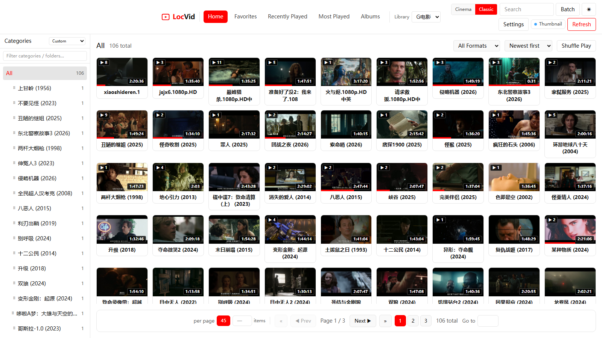
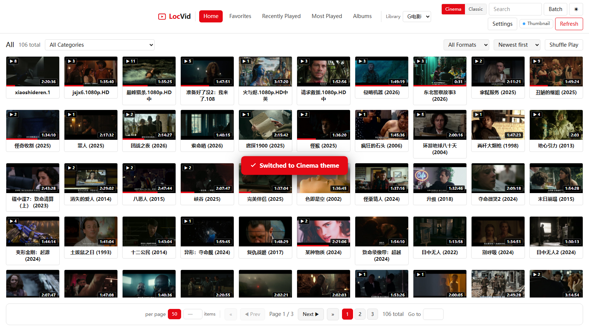
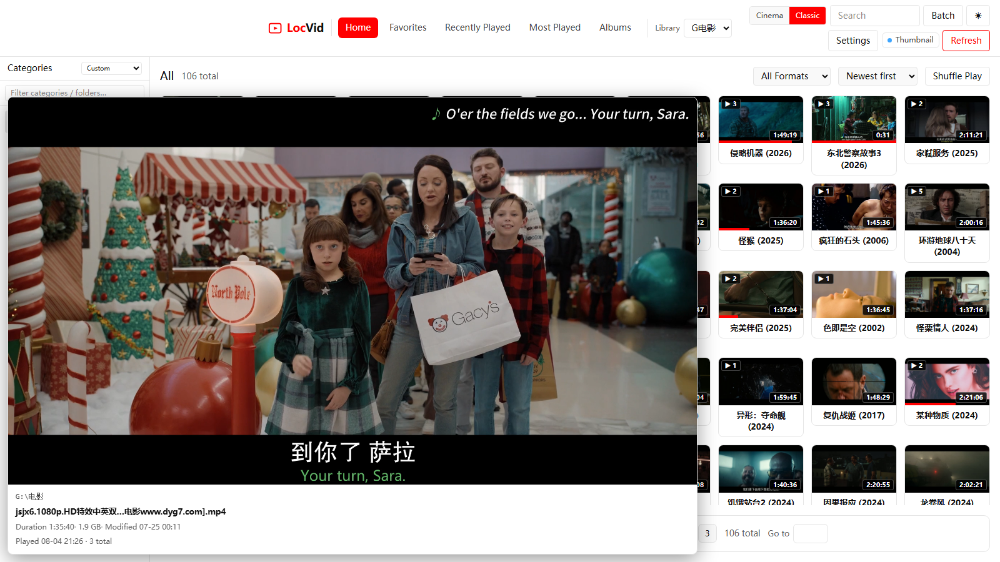
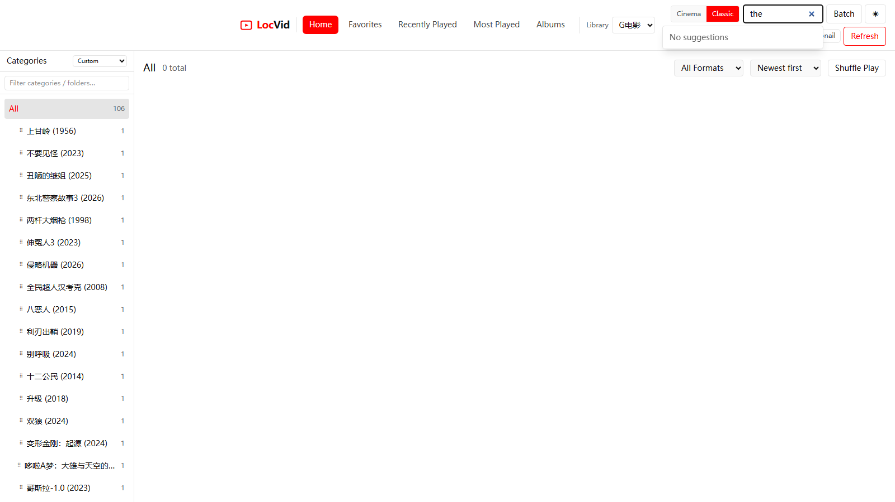
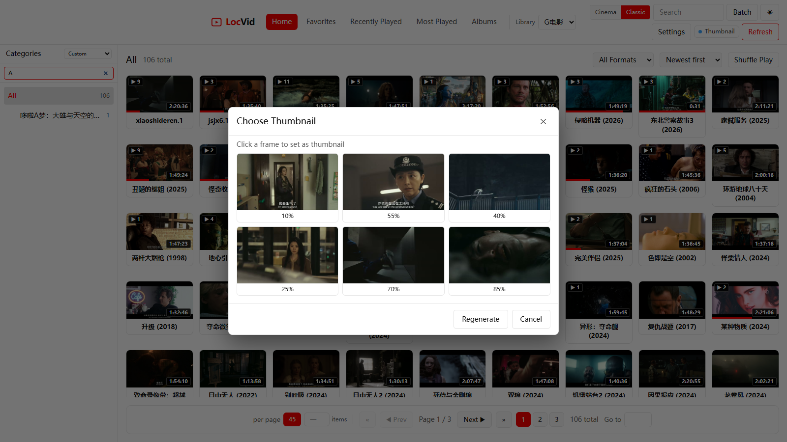
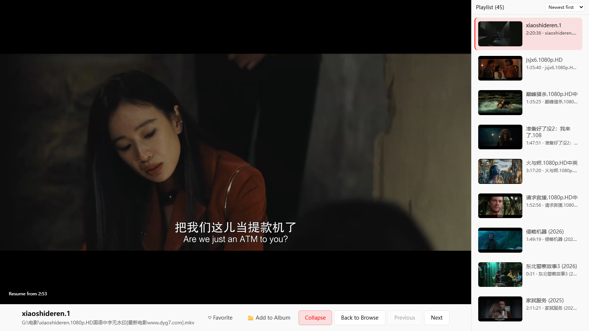
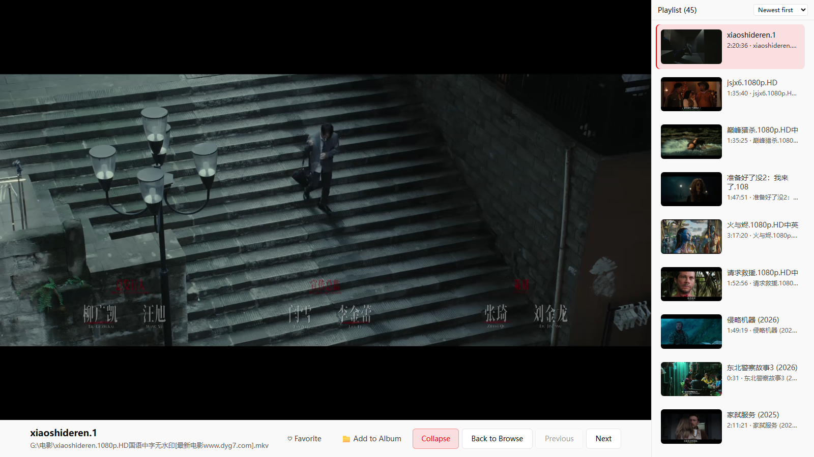
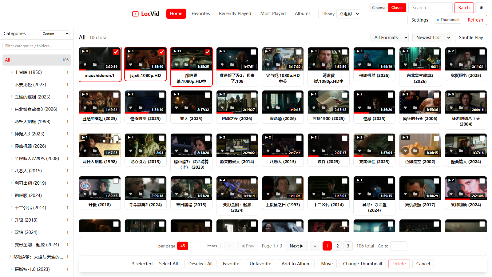
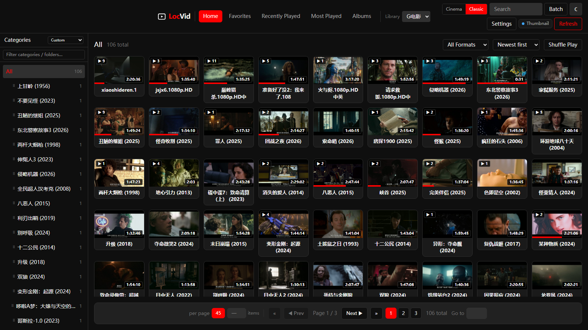

# Screenshots / 截图集

英文在前，中文在后。所有截图均基于 **G电影** 库的真实数据截取。

English first, Chinese after. All screenshots are captured against real data in the **G电影** library.

---

## Browse / 浏览

<table>
<tr>
  <td width="50%"> <b>EN</b> Gallery (Classic) — paginated thumbnail grid &amp; category sidebar <b>中文</b> 画廊（经典）— 分页缩略图网格 + 分类侧栏</td>
  <td width="50%"> <b>EN</b> Gallery (Cinema) — full-width layout with category dropdown <b>中文</b> 画廊（影院）— 全宽布局 + 分类下拉</td>
</tr>
<tr>
  <td> <b>EN</b> Hover preview — preview frame + progress on card hover <b>中文</b> 悬停预览 — 鼠标悬停显示预览画面与进度</td>
  <td> <b>EN</b> Search suggestions — keyword suggestions &amp; search history <b>中文</b> 搜索建议 — 关键字建议 + 搜索历史</td>
</tr>
<tr>
  <td> <b>EN</b> Sidebar filter — live category/folder filtering <b>中文</b> 侧栏过滤 — 实时过滤分类/文件夹</td>
  <td></td>
</tr>
</table>

## Playback / 播放

<table>
<tr>
  <td width="50%"> <b>EN</b> Player — movi-player real video frame + playlist (right) <b>中文</b> 播放器 — movi-player 真实画面 + 右侧播放列表</td>
  <td width="50%"> <b>EN</b> Audio / subtitle track selection panel <b>中文</b> 音轨 / 字幕选择面板</td>
</tr>
</table>

## Organize / 整理

<table>
<tr>
  <td width="50%"> <b>EN</b> Batch selection — multi-select cards &amp; batch action bar <b>中文</b> 批量选择 — 多选卡片 + 批量操作条</td>
  <td width="50%"></td>
</tr>
</table>

## Theme / 主题

<table>
<tr>
  <td width="50%"> <b>EN</b> Same gallery in light theme — dark / light theme switch <b>中文</b> 同一画廊在亮色主题下 — 暗 / 亮主题切换</td>
  <td width="50%"></td>
</tr>
</table>

---

> **Capture method / 截取方法**: [`e2e/capture-screenshots.mjs`](https://github.com/hoolulu/LocVid/blob/master/frontend/e2e/capture-screenshots.mjs) — Playwright script, 1600×900, English UI, real G电影 library data. Re-run anytime to refresh.